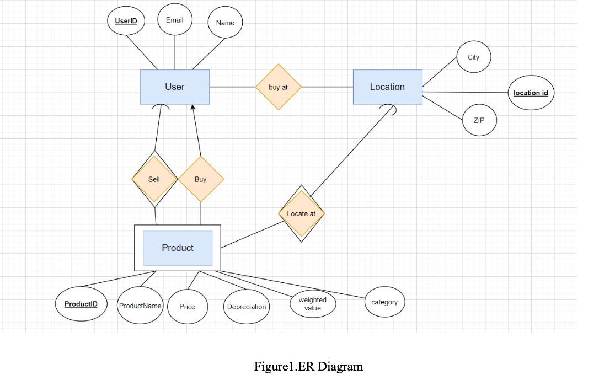
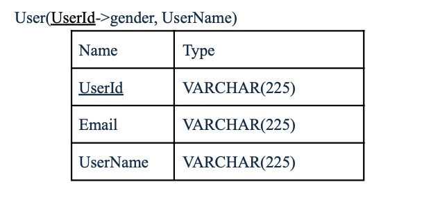
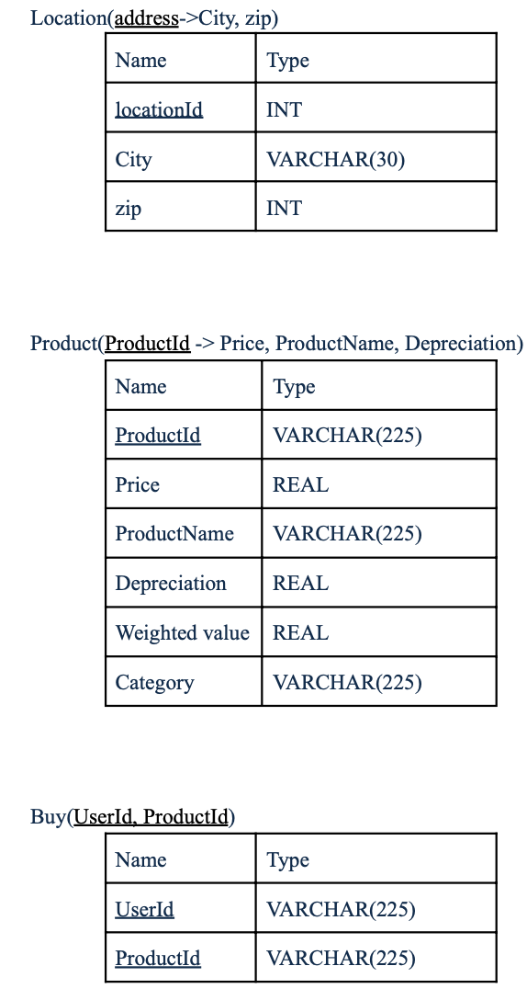

# eCommerce_Website

**Please reder the [eCommerce_erbsite.pdf](https://github.com/linfeijing2/eCommerce_Website/blob/master/e-commerce_website.pdf) for the detailed report of this project .**

**Purpose and Usefulness**

The project is capable of providing a platform for face-to-face second-hand goods trading around the campus town by letting users browse the details of commodities and contact sellers privately via email.

We found that during the graduation seasons or term begins seasons, there’re lots of students willing to buy or sell second-hand items to save money, like sofas, mattresses, second-hand textbooks, or iclickers. When the semester starts, the demand for these items is often very urgent. If people choose to buy these things on eBay or Amazon, it usually will cost more than one week to wait for the items.

Therefore, second-hand trading between the same cities and even the same campus is very important. During the past, many students preferred to post the information on social media, such as Facebook and Twitter. However, these websites can’t conveniently integrate these pieces of information; for example, these applications can’t separate the goods by its prices and by its categories. People usually have to spend a long time browsing every post and find the information matches their requirements.

**Data in Database**

We collect the data from our friends, about 25 friends, 5 goods per person on average, since there is a lot of demand for selling out commodities during summer. Then by manually inputting the data, the database stores all the information which can be used in our project. The users will be asked to enter their contact information when they register, and the information about products, including the city of the transaction, the price, depreciation, and category of the products they

**ER Diagram and Schema**

**Basic Fuctions**

* The functionalities in our app are register, login, create products, delete products, update products, search products, and recommendation.
* The register can help the users create their own account and save the account information to the local sql file.
* The login can constrain the users to their own accounts and change the products in the account. And they are allowed to view others’ products as well.
* The create products can help users put more products they want to sell to the website. The users’ operations will also be saved to the local sql file.
* The delete products can help users delete the products they sold or they did not want to sell any more. The users’ operations will also be shown in the local sql file.
* The update products can help users change products properties such as price. The users’ operations will also be shown in the local sql file.
* The search product can help the users find the products they via entering the product name in the searching bar.
* The recommendation will implement search inside B+ tree and return the desirable commodities to the users via the preferences the users chose when they registered.

**Video Presentation**
https://youtu.be/IpTSK4iFEew